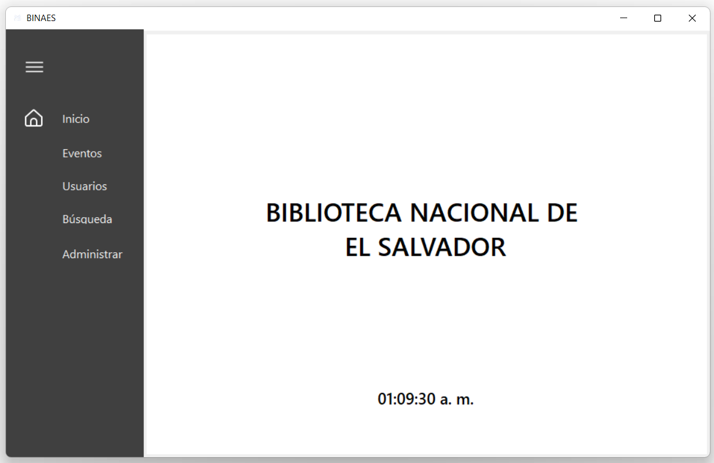
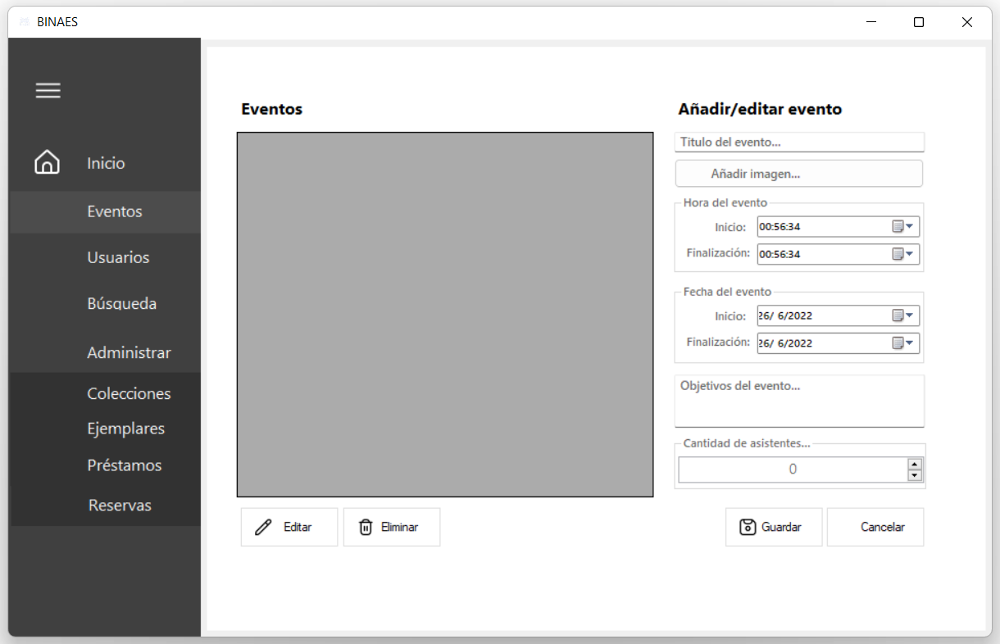
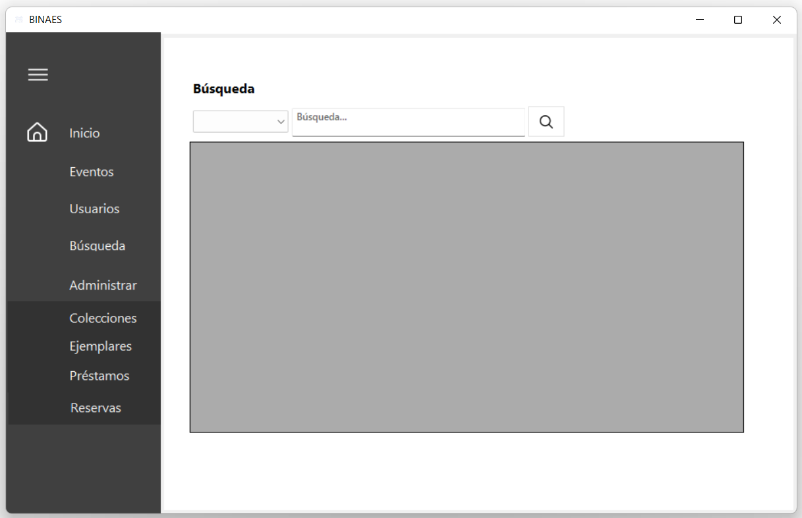
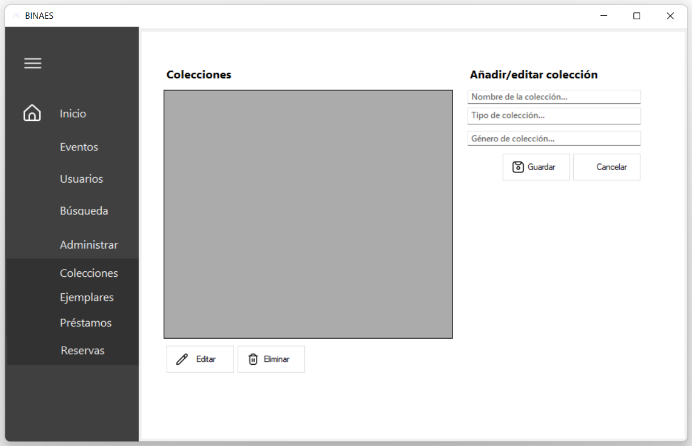
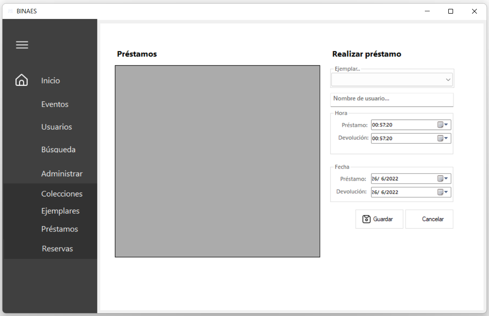
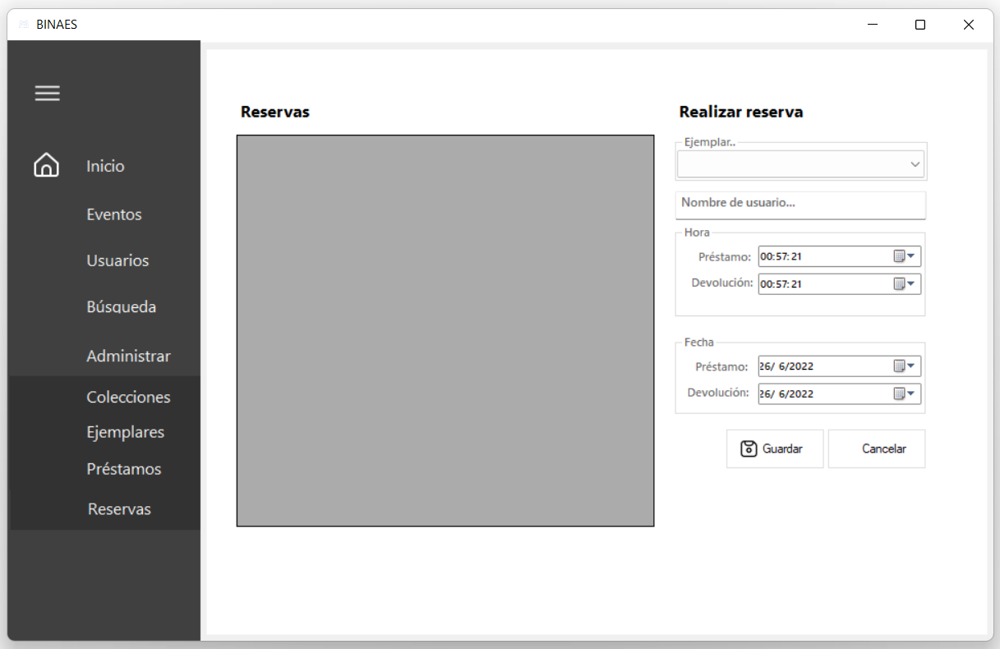

**Manual de Usuario**
 
> *El siguiente software consiste en el gestionamiento de toda la información de la nueva Biblioteca nacional BINAES, dicha aplicación cuenta con diferentes apartados en los cuales los usuarios puedan realizar búsquedas del material bibliográfico y multimedia con el cual cuenta  BINAES*
 
 

> *Para añadir o editar un evento diríjase a "Eventos". Ahí encontrará cuadros que le solicitan información. Primero se coloca el Título del evento y se añade una imagen. Luego se selecciona la hora y fecha de inicio y finalización del evento. En acto siguiente agregue el o los objetivos del evento y la cantidad de personas que podrán asistir. Al haber llenado todo solo se guardan los cambios. Y de haber sido editar o eliminar evento solo se busca en el cuadro con todos los eventos guardados y ahi se efectúa como sea requerido.*

 

 

> *Para añadir o editar un usuario, se dirige al panel "Usuarios" ahí se le pide que coloque su nombre, una imagen, su ocupación, institución, dirección, un teléfono y su correo electrónico. Al haber llenado todos los campos y estar seguro de todos los datos ingresados, guarda su usuario. Y si en algún momento quiere realizar cambios en su usuario solo se dirige a editar, realiza los cambios y guarda.*
 
 
 

 

> *Cuando desee realizar una búsqueda de algún artículo, se dirige al panel de Búsqueda y digita el artículo del cúal desea conocer, presiona la lupa para realizar las búsqueda e inmediatamente le mostrará las posibles opciones a su solicitud.*

 

> *Para agregar un artículo a una colección en específico, se dirige al panel "Administrar" "Colecciones" y ahí se podrá editar o agregar una colección. Guardamos los cambios realizados.*

 
 

> *Si se desea editar o agregar un ejemplar nuevo solo se dirige al panel "Administrar" "Ejemplares" agregamos el nombre, una fotografía, definir a qué colección pertenece, su autor, fecha de publicación, editorial, formato del ejemplar, el idioma en que se encuentra, agregar unas palabras claves para que su búsqueda se vuelva más rápida y ubicar si se encuentra disponible o no. Guardamos cambios.*

 
> *Para realizar un préstamo, dirígete al panel "Administrar" "Préstamos" se selecciona el ejemplar que se desea prestar, se agrega su nombre de usuario para estar registrado, selecciona el día y la hora de préstamo y de la devolución. Guardar cambios.*

 
> *Cuando quieras hacer un préstamo y este no se encuentra disponible, dirígete al panel de "Administrar", "Reservas" y ahí seleccionas el ejemplar, ingresas tu usuario, fecha y hora de préstamo y devolución. Guardar cambios.*

 
 
 
 
| Posible Error    |              Cuadro de Dialogo              |
| ---------------- | ------------------------------------------- |
| ddsdsdd          | |
